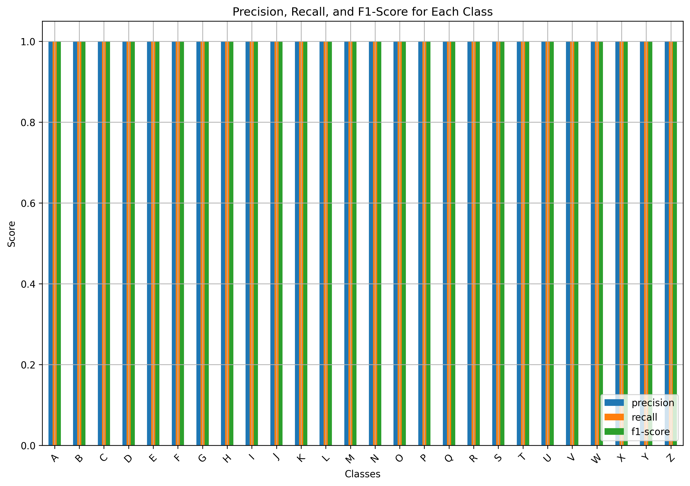
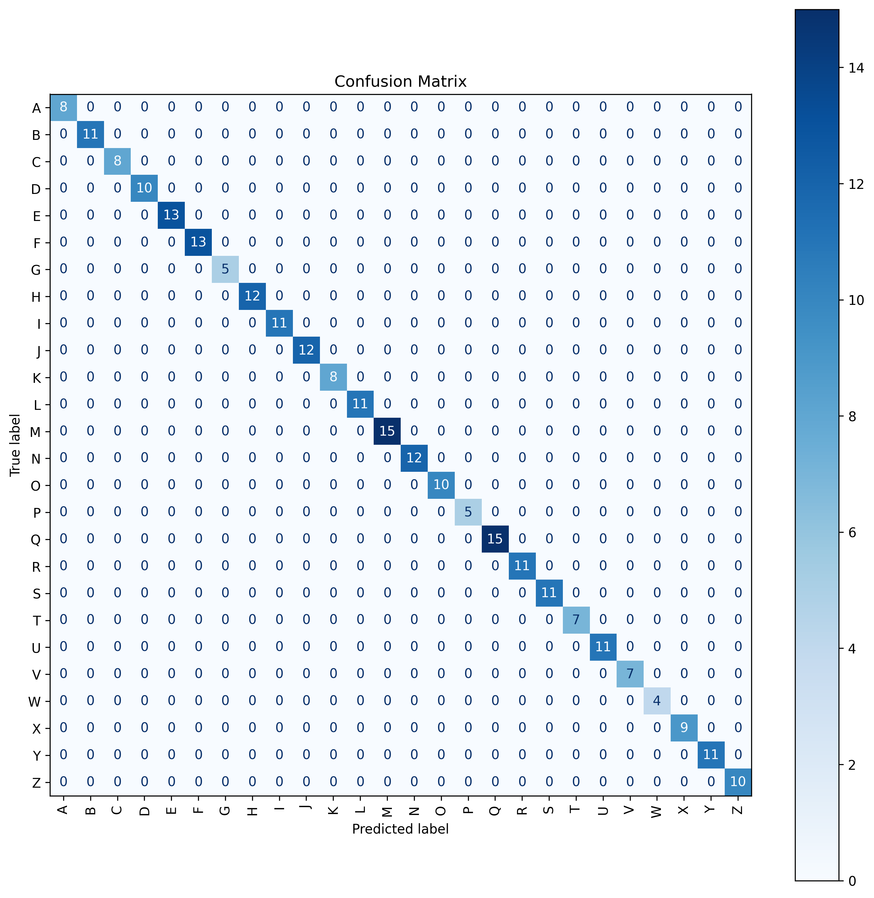

# AUSLAN Fingerspelling Real-Time Gesture Recognition

Welcome to the AUSLAN Fingerspelling Real-Time Gesture Recognition project! This repository contains all the code and resources for building a real-time gesture recognition system for AUSLAN (Australian Sign Language) fingerspelling using machine learning and computer vision techniques.

## Table of Contents
- [Project Overview](#project-overview)
- [Dataset Preparation](#dataset-preparation)
  - [Data Collection](#data-collection)
  - [Data Preprocessing](#data-preprocessing)
  - [Data Augmentation](#data-augmentation)
- [Model Development](#model-development)
  - [Model Architecture](#model-architecture)
  - [Training Strategy](#training-strategy)
  - [Addressing Key Challenges](#addressing-key-challenges)
- [Real-Time Gesture Recognition](#real-time-gesture-recognition)
  - [System Architecture](#system-architecture)
  - [Implementation Details](#implementation-details)
- [Results](#results)
- [Installation and Usage](#installation-and-usage)
  - [Prerequisites](#prerequisites)
  - [Installation](#installation)
  - [Running the Application](#running-the-application)
- [Project Structure](#project-structure)
- [Contributing](#contributing)
- [License](#license)
- [Acknowledgements](#acknowledgements)

## Project Overview
The goal of this project is to develop a robust real-time gesture recognition system capable of recognizing AUSLAN fingerspelling gestures (letters A-Z). The system leverages machine learning techniques and computer vision to interpret hand gestures captured through a webcam and translate them into corresponding letters.


### Key Features:
- Real-time gesture recognition using a webcam.
- Robust to variations in distance from the camera and hand sizes.
- High accuracy achieved through data augmentation and normalization techniques.
- Visual feedback displaying detected gestures and confidence levels.

## Dataset Preparation
### Data Collection
We used MediaPipe's Holistic model to collect keypoint data from videos of individuals performing AUSLAN fingerspelling gestures. The keypoints include 3D coordinates of the hand landmarks.

#### Steps:

1. **Recording Gestures**:
   - Captured multiple sequences (videos) for each letter (A-Z), with each sequence consisting of 30 frames.
   - Ensured diversity by recording gestures from different individuals and varying conditions.

2. **Keypoint Extraction**:
   - Used MediaPipe to extract left and right hand landmarks from each frame.
   - Stored the extracted keypoints as NumPy arrays (.npy files) for efficient storage and processing.

#### Why Use Keypoints Instead of Images?
- **Efficiency**: Keypoints require significantly less storage space than raw images.
- **Focus on Relevant Data**: Keypoints capture essential information for gesture recognition, removing background noise.
- **Faster Processing**: Working with numerical data speeds up training and inference.

### Data Preprocessing
To make the model robust to variations in hand size and distance from the camera, we applied several preprocessing steps:

#### Normalization:
- **Centering**: Centered hand keypoints around the wrist landmark.
- **Scaling**: Scaled the keypoints based on the distance from the wrist to the middle finger MCP joint.
- **Purpose**: Ensures that the model focuses on the relative positions of landmarks rather than absolute positions.

#### Consistent Input Shapes:
- Handled missing landmarks by filling in zeros to maintain consistent input sizes.

### Data Augmentation
To enhance the model's ability to generalize, we applied data augmentation techniques:

- **Noise Injection**: Added Gaussian noise to simulate sensor inaccuracies.
- **Scaling**: Randomly scaled sequences to simulate varying distances from the camera.
- **Time Warping**: Altered the temporal dynamics to simulate variations in gesture speed.

#### Implementation:
- Augmentations were applied randomly with a 50% chance.
- The augmented data was combined with the original dataset, effectively doubling the size.

## Model Development
### Model Architecture
We built a deep learning model using TensorFlow and Keras, focusing on capturing temporal patterns in the gesture sequences.

#### Architecture:
- **Input Layer**: Sequences of shape (30, 126), where 126 is the flattened size of the hand keypoints for both hands.
- **LSTM Layers**:
  - Three LSTM layers with 64, 128, and 64 units respectively.
  - Captures temporal dependencies in the data.
- **Batch Normalization and Dropout**:
  - Applied after each LSTM layer to prevent overfitting and improve generalization.
- **Dense Layers**:
  - A Dense layer with 64 units and ReLU activation.
  - Output layer with softmax activation for classification into 26 classes.

### Training Strategy
#### Loss Function and Optimizer:
- Used categorical cross-entropy loss and the Adam optimizer with a learning rate of 1e-4.

#### Class Weights:
- Computed to handle class imbalance.

#### Callbacks:
- **ModelCheckpoint**: Saves the best model based on validation loss.
- **ReduceLROnPlateau**: Reduces the learning rate when the validation loss plateaus.
- **EarlyStopping**: Stops training when the validation loss doesn't improve.

#### Training Process:
- Trained for 50 epochs with a batch size of 32.
- Used 80% of the data for training and 20% for validation.

### Addressing Key Challenges
1. **Variations in Distance from the Camera**:
   - Issue: Model performance degraded when the subject was far from the camera due to changes in keypoint scales.
   - Solution: Normalized hand keypoints independently and applied scaling augmentation to simulate different distances.

2. **Varying Hand Sizes**:
   - Issue: Different hand sizes (e.g., children vs. adults) affected model performance.
   - Solution: Normalized hand keypoints to make the model invariant to hand size and included diverse hand sizes in the dataset.

## Real-Time Gesture Recognition
### System Architecture
The real-time gesture recognition system consists of:

- **Video Capture**: Captures frames from the webcam using OpenCV.
- **Hand Landmark Detection**: Uses MediaPipe's Holistic model to detect hand landmarks.
- **Preprocessing**: Extracts and normalizes keypoints using the same methods as during training.
- **Gesture Prediction**: Feeds sequences of keypoints into the trained model to predict gestures.
- **Visualization**: Displays the webcam feed with overlayed landmarks, predicted gestures, and confidence bars.
- **Video Recording**: Records the real-time detection session for demonstration purposes.

### Implementation Details
- **Sequence Management**: Maintains a sliding window of the last 30 frames for prediction.
- **Prediction Consistency**: Uses a threshold and checks for consistent predictions over multiple frames to reduce noise.
- **Visualization**: Probability bars show the confidence for each gesture, and detected gestures are displayed on the screen.
- **Recording**: Utilizes OpenCV's VideoWriter to record the session.

## Results
- **Test Accuracy: Achieved a test accuracy of 99%.**
- **Real-Time Performance**: The model performs robustly in real-time, accurately recognizing gestures despite variations in distance and hand size.

- ##### Real-Time Demonstration

  [](https://youtu.be/YwLv4xW-3Vw)


  
- **Classification Report**:

  
  

- **Precision, Recall, F1-score**:

  

- **Confusion Matrix**:
  
  

- **Tranning and Validation Accuracy**:
  
  
 

## Installation and Usage
### Prerequisites
- Python 3.7 or higher
- Required Python packages:
  - OpenCV (opencv-python)
  - MediaPipe
  - TensorFlow
  - NumPy
  - Matplotlib
  - Scikit-learn
- A webcam for real-time detection

### Installation
1. **Clone the Repository**:
   ```bash
   git clone https://github.com/yourusername/auslan-gesture-recognition.git
   cd auslan-gesture-recognition
   ```
2. Create a Virtual Environment (Optional but Recommended):
   ```bash
   python -m venv venv
   source venv/bin/activate  # On Windows: venv\Scripts\activate
   ```
3. Install Dependencies:
   ```bash
   pip install -r requirements.txt
   ```
### Running the Application
1. Download or Collect Data:
   - If using pre-collected data, ensure it's placed in the AUSLAN_Data directory with the correct structure.
   - To collect your own data, use the data_collection.py script.

2. Train and Real Time Detection:
   auslan_sign_final_model.ipynb

3. View Recorded Video (Optional): The real-time detection script saves a video named output.avi. You can view this video to see the recorded session.

### Project Structure:
```
auslan-gesture-recognition/
├── AUSLAN_Data/             # Directory containing gesture data
│   ├── A/
│   │   ├── 0/
│   │   │   ├── 0.npy
│   │   │   ├── ...
│   │   ├── ...
│   ├── B/
│   ├── ...
├── models/
│   ├── best_model.keras     # Saved trained model
├── data_collection.py       # Script for data collection
├── train_model.py           # Script for training the model
├── real_time_detection.py   # Script for real-time gesture recognition
├── requirements.txt         # List of required Python packages
├── README.md                # Project documentation
└── LICENSE                  # License information
```

Thank you for your interest in this project! If you have any questions or suggestions, feel free to open an issue or contact me directly.
Contact
```python
- Email: khobragade.vaibhav8@gmail.com
- GitHub: Vaibhav Khobragade
```   
